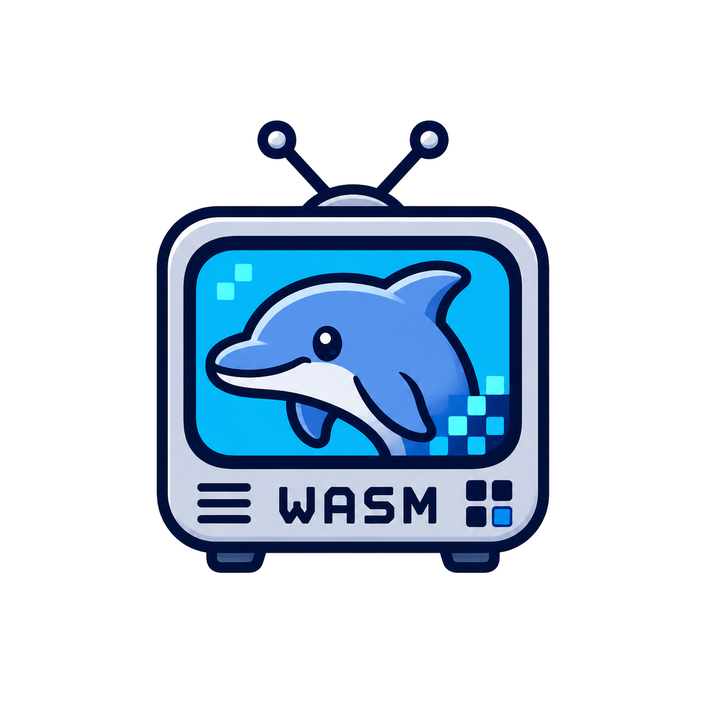

<p align="center">
  
</p>

<h1 align="center">wasm-dolphin</h1>

<p align="center">
  <a href="#license-and-attribution"></a>
  <a href="https://nodejs.org/"></a>
  <a href="package.json"></a>
  <a href="#requirements"></a>
  <a href="https://emscripten.org/"></a>
  <a href="docs/current-status.md"></a>
</p>

Run the **Dolphin** GameCube/Wii emulator in a Chrome tab, compiled to
WebAssembly. The best-supported title is **Super Smash Bros. Melee**, which can
approach 100% game speed on a modern desktop browser.

Under the hood this is the upstream [Dolphin](https://github.com/dolphin-emu/dolphin)
C++ codebase cross-compiled with Emscripten, driven by a small JavaScript host
that owns the canvas, audio, input, save-states, and file mounting. A custom
PowerPC→WASM JIT and a software-rendering + WebGPU-presentation pipeline make
real-time play possible inside the browser sandbox.

> **License note:** Dolphin is GPLv2+. Any distributed combined build that
> includes the vendored Dolphin sources or the built core `.wasm` must comply
> with GPLv2+. See [License and attribution](#license-and-attribution). Bring your own game images — none are
> included.

---

## Quick start

A prebuilt core `.wasm` is committed and the project has **zero npm
dependencies**, so there is nothing to install or build before playing:

```bash
git clone https://github.com/dougchansan/wasm-dolphin && cd wasm-dolphin && npm run play
```

`npm run play` starts the local dev server (which sends the COOP/COEP headers
SharedArrayBuffer needs) and opens the page in your default browser. Then
**drag a disc image onto the page**.

That is the whole setup. Two variants if you need them:

```bash
npm start            # same server, but don't open a browser
PORT=9000 npm start  # pick the port (default 8080; it steps up if taken)
```

<details>
<summary>No git? Download the ZIP instead</summary>

You do not need git, and you do not need to build anything — the core `.wasm`
is committed, so the ZIP is a complete, runnable copy.

1. Download **[the current source ZIP](https://github.com/dougchansan/wasm-dolphin/archive/refs/heads/main.zip)**
   (the same thing as *Code → Download ZIP* on the repository page).
2. Unzip it anywhere.
3. Open a terminal **in the unzipped folder** and run:

```bash
npm run play
```

Node.js 18+ is the only prerequisite. If you would rather not go through npm at
all, the server is one plain Node command:

```bash
node tools/serve.mjs --open
```

</details>

<details>
<summary>Requirements</summary>

- **Node.js 18+** — only to run the dev server and tooling. No packages are
  installed; `npm install` is a no-op and can be skipped.
- **Chrome (or another Chromium browser) on desktop** — WebGPU and
  SharedArrayBuffer are both required. The dev server sends the
  `Cross-Origin-Opener-Policy` / `Cross-Origin-Embedder-Policy` headers that
  enable SharedArrayBuffer; opening `index.html` from the filesystem will not
  work.
- **Your own disc images** — `.iso`, `.nkit.iso`, `.rvz`, `.ciso`, and the
  containers Dolphin's DiscIO accepts.

</details>

<details>
<summary>Serving it yourself (any other static server)</summary>

Any static file server works as long as it sends these two headers on every
response:

```http
Cross-Origin-Opener-Policy: same-origin
Cross-Origin-Embedder-Policy: require-corp
```

Without them the page loads but the core cannot allocate the shared memory it
needs, and boot fails. `tools/serve.mjs` exists mostly to get this right.

</details>

---

## What you get on the page


The header carries the status pill and the `FPS` / `DBG` / `PANEL` toggles; the
console shows a `NO DISC` bezel until you drop one in, with the metrics strip
across the top and the transport row along the footer (open disc, pause, reset,
mute, save/load state, aspect). `PANEL` opens the settings side panel on the
right.

Nothing has to be configured — every control below already sits on the
validated software-hybrid path, and **Auto per-game** overrides the renderer
for titles with a measured profile. Change something and **Apply restart**
reboots the core with it; **Melee preset** restores the tuned Melee
configuration.

| Setting | Default | What it does | URL flag |
|---------|---------|--------------|----------|
| Core | Upstream | Which core the host loads. **Upstream** is the Emscripten build of Dolphin; *Native* is the from-scratch scaffold under `core/native`. | `core=upstream` |
| Renderer | Software | Which Dolphin video backend runs. **Software** is the rasterizer everything is validated against; *WebGPU hardware* is the experimental GPU path, and *Null* draws nothing. | `video=software` |
| GPU path | Direct worker GL | How the OpenGL backend's context reaches the canvas — only meaningful for *Renderer: OpenGL*. **Direct worker GL** keeps the context in the worker and posts a frame back per present. | `oglproxy=worker` |
| Resolution | Full 640x480 | Scale of the presented image. Lower settings cut **presentation** cost only; the core still emulates at full resolution. | `present=full` |
| Speed | 1x | Emulation speed target. *Unlimited* removes the throttle and runs as fast as the machine allows. | `speed=1` |
| CPU | Dual core | Whether the core runs its CPU and GPU threads separately (**Dual core**) or folded onto one. | `cpu=dual` |
| Presenter | WebGPU | Which browser API blits the finished frame onto the canvas. Falls back to *WebGL* / *Canvas 2D* where WebGPU is unavailable. | `presenter=webgpu` |
| Frame queue | 4 frames | How many frames the paced presenter buffers before painting. Deeper is smoother but adds latency. | `queue=4` |
| Pacing | Tick | When the canvas repaints. **Tick** paints each new frame immediately *and* re-paints the last good frame on a steady 16.7ms tick, so the canvas keeps refreshing while the rasterizer repeats frames. | `pacing=tick` |
| Raster quality | Balanced | How much the software rasterizer and XFB encode are thinned. **Balanced** shades one sample per 2×2 cell; see [Raster quality](#raster-quality-fastsw). | `fastsw=1` |
| JIT tier | Guarded | Which PPC→WASM blocks the JIT is allowed to emit. **Guarded** is the conservative set; *Mixed experimental* widens it (same as `wasmjit=2`). | `jittier=guarded` |
| WASM JIT | on | The PPC→WASM JIT itself. Off falls back to Dolphin's `CachedInterpreter`. | `wasmjit=1` |
| Force JIT | off | Bypasses the JIT's safety gates — the warmup-frame floor, and the JIT-off default on the OpenGL path. | `forcejit=1` to enable |
| Collect Metrics | off | Turns on the telemetry counters behind the HUD and profiler. Off by default because the counting itself costs time. | `metrics=1` to enable |
| Auto per-game | on | Picks the renderer from measured per-game results — see [per-game renderer defaults](#per-game-renderer-defaults). | — |

Settings left at their default are stripped from the URL rather than written
into it, so a bare `/` and the values above are the same run.

Every setting is also a URL parameter, so any configuration is a shareable
link. See [rendering modes](docs/rendering-modes.md) and
[JIT flags](docs/jit-flags.md) for the full flag surface.

---

## Status at a glance

| Area | State |
|------|-------|
| Melee boot + gameplay (software hybrid) | ✅ Playable when locally validated; speed is scene/machine dependent |
| Broader GameCube library | ✅ Boots widely; per-game renderer defaults from two 45-disc sweeps |
| Wii discs | ⚠️ Boot and run on the software path; no Wii Remote input yet |
| PPC→WASM JIT with GPR register cache | ⚠️ Default-on; old `addzex` failures are fixed, benefit remains scene-dependent |
| Presentation smoothness (pacing, fast raster) | ✅ Tunable; software rasterizer caps unique-frame rate |
| Audio | ✅ Worker-fed/tuned audio buffering |
| WebGPU **hardware** renderer (`video=wgpu`) | ⚠️ Correct and much faster on some titles, broken on others; opt-in per game |

The default configuration is the locally validated software-hybrid path:
`video=software&presenter=webgpu`. The true hardware WebGPU renderer is
`video=wgpu` and remains experimental — but see
[per-game renderer defaults](#per-game-renderer-defaults), which switches
individual titles onto it automatically where that was measured *and* checked
by eye.

**Project references:** [current status](docs/current-status.md) ·
[rendering modes](docs/rendering-modes.md) · [JIT flags](docs/jit-flags.md) ·
[reproducible build](docs/repro-build.md) · [latest audit](docs/performance-audit-2026-07-10.md) ·
[validation evidence](docs/perf-results/melee-performance-evidence-2026-07-10.md)

### Recommended explicit URL

The defaults already select the software-hybrid path. This URL pins every knob,
for reproducible measurements:

```text
/?core=upstream&video=software&presenter=webgpu&cpu=dual&speed=1&wasmjit=1&jitwarmup=700&oc=1&pacing=tick&fastsw=1&metrics=1
```

- `video=software` + `presenter=webgpu` — software rasterizer, presented to the
  canvas through a WebGPU blit (the "software hybrid").
- `wasmjit=1` — request the guarded PPC→WASM JIT; verify each run's metrics.
- `pacing=tick` — repaint the canvas on a steady tick for smoother scrolling
  (default for software paths).
- `fastsw=1` — balanced/crisp fast software mode (see [Raster quality](#raster-quality-fastsw)).

After the configured warmup the status pill may announce *"Experimental WASM JIT
enabled after N stable video frames"*. Game speed and visual cadence remain
scene-, cache-, browser-, and machine-dependent.

---

## Controls

| Input | Keys |
|-------|------|
| A / B / X / Y | `X`, `Z`, `S`, `A` |
| Start | `Enter` |
| L / R / Z | `Q`, `E`, `C` |
| D-pad | Arrow keys |
| Main stick | `W`, `A`, `S`, `D` |

Standard browser gamepads are also polled. Wii Remote input is not implemented.

---

## Architecture

```
 ┌─────────────────────── Chrome tab ───────────────────────┐
 │  Main thread (src/)                                       │
 │   app.js · core-host.js · input.js · audio · settings     │
 │        │  canvas (WebGPU present)   ▲ audio   ▲ input      │
 │        ▼                            │         │            │
 │  Web Worker: upstream-discio-worker.js                    │
 │        │ mounts ISO via Emscripten WORKERFS                │
 │        ▼                                                   │
 │  dolphin-core-upstream.wasm  (Emscripten build of Dolphin)│
 │    • PowerPC CPU: CachedInterpreter → WASM JIT + regcache  │
 │    • Software VideoBackend: rasterizer → EFB → XFB encode  │
 │    • DSP audio, DiscIO, scheduler, save-states             │
 │    • (opt) WebGPU hardware backend + Naga SPIR-V→WGSL      │
 └───────────────────────────────────────────────────────────┘
```

### CPU: the PowerPC → WASM JIT

Dolphin's `CachedInterpreter` is extended to emit a **WebAssembly module per
basic block** instead of interpreting PowerPC ops one at a time. The key
optimization is a **GPR register cache**: the 32 PowerPC general-purpose
registers are held in WASM locals for the life of a block (loaded in the
prologue, flushed at block end and around calls) instead of round-tripping to
the emulated register file on every access.

- A historical local A/B reported **+38% raw throughput**. The eight later
  fixed-scene emit failures were all an accidental `addzex` diagnostic disable
  and are fixed, but no current repeated A/B reproduces the +38% claim.
- Escape hatch: `?regalloc=0` disables it.
- `?smearcompile=1` (default-on) spreads JIT compilation to reduce mid-match
  compile bursts.

The browser sandbox constrains how far this can go: there is no host memory-trap
("fastmem") path, every emulated memory access is bounds-checked in software,
and the dynamic PPC JIT does not yet emit SIMD. See
[the JIT flag reference](docs/jit-flags.md) and
[`docs/core-roadmap.md`](docs/core-roadmap.md).

### Rendering: the software hybrid (default)

The default path uses Dolphin's **software rasterizer** for correctness, then
**presents** the framebuffer to the page via WebGPU (or WebGL/Canvas fallback):

```
software rasterizer → EFB → XFB (YUV encode) → WebGPU presenter → <canvas>
```

The main measured smoothness limit on this path is the software GPU: game
timing can approach its target while the rasterizer produces relatively few
distinct frames. Three profiler runs averaged about 59.7 presentation FPS but
only 12.8 unique visual FPS, with 78.3% sampled stale-source reuse. Raster,
TEV, texture, FIFO, and XFB phase counters identify where to optimize without
changing correctness. Two knobs expose the tradeoff.

#### Pacing

`?pacing=` controls how the canvas is refreshed: `tick` (default; immediate
fresh frames plus duplicate re-paints), `smooth` (paced queue), or `direct`
(immediate fresh frames only). WebGPU hardware uses `smooth`;
`legacytickqueue=1` restores the old queued `tick` route for rollback.

#### Raster quality (`fastsw`)

`?fastsw=` thins the software raster and XFB encode. Aggressive modes can raise
unique-frame cadence, but are not guaranteed to raise game speed:

| `fastsw` | What it does | Quality |
|:--:|------|------|
| `0` | Upstream full-resolution raster/encode | Literal full quality; slowest |
| `1` (default) | 2×2 sampled raster with replicated cells | Crispest recommended fast mode |
| `2` | 4×4 sampled raster with row duplication | Most aggressive; blocky bands |
| `3` | 4×4 sampled raster with vertical interpolation | Aggressive; smoother bands |

`fastsw=3` reconstructs the rows that `fastsw=2` duplicates by interpolating
between neighbors. Mode 1 shades one sample per 2×2 cell; modes 2 and 3 shade
one per 4×4 cell. None is literal full quality; `fastsw=1` remains the crisp
default. Results are scene-dependent — see the
[measured performance audit](docs/performance-audit-2026-07-10.md).

### Rendering: WebGPU hardware backend (experimental)

`?video=wgpu` selects the true WebGPU hardware renderer command path, intended
to bypass the software-raster unique-frame ceiling. It is dramatically faster on
some titles (60 vs 7–10 unique visual FPS) and visibly wrong or non-progressing
on others, which is why it is opt-in rather than the global default.

For Melee specifically: on the validation GPU the first completed 108-draw EFB
pass contains nonzero color and the fixed battle is visible, but replay still
averages only about 68% game speed and 30 presents/s in the retained JIT-off
runs.

`?video=wgpu` measures its own unique-visual-frame rate. Each submitted
backbuffer is downsampled on the GPU to 96x72 with the existing fullscreen
presenter, then hashed after asynchronous readback through a fixed three-buffer
ring. The public visual FPS/source fields and `visualCadenceTelemetry` report
completed unique samples and any ring-busy drops. `?wgpuvisual=0` opts a
hardware run back out for perf-attribution work that must not pay the GPU pass
and mapped readback; with the readback off, the path reports its sample source
as `unsampled` rather than claiming an `xfb-hash` it never took.

This path needs Dolphin's shaders in WGSL. Dolphin generates GLSL → glslang
compiles it to SPIR-V (in C++) → the Rust crate below does the final hop.

### Per-game renderer defaults

The two video paths differ enormously per title, so the shipping default is
chosen **per game** from measured evidence. [`src/game-profiles.js`](src/game-profiles.js)
holds the table, built from two full 45-disc sweeps on the same machine and
harness. When you drop a disc in, the host reads the 6-character game id
straight out of the file (before the core loads, since the video backend is
fixed at worker start) and applies the profile, announcing it in the status
line.

The rule for entering a game is deliberately strict: a *hardware*
recommendation needs the frame checked by eye against the software render **and**
a material speed win — a wrong frame can be fast. Titles with a big FPS win but
no verified screenshot are left out. Anything absent from the table keeps the
shipping default. See [the hardware renderer bug log](docs/webgpu-hardware-renderer-bugs.md).

### Rust: `tools/naga-spirv-wgsl`

A small Rust staticlib that transpiles **SPIR-V → WGSL** using wgpu's
[`naga`](https://github.com/gfx-rs/wgpu). It is compiled for
`wasm32-unknown-emscripten` and linked directly into the core `.wasm`, giving
`WebGPUShaderTranslator::SpirvToWgsl` a synchronous C-ABI call with no async
worker round-trip. Built with `cargo build --release --target
wasm32-unknown-emscripten`; `panic = "abort"` so a translation failure can never
unwind across the FFI boundary (it returns null + a `naga_last_error()` string
instead).

> This is the **only** Rust in the project, and it exists solely to support the
> experimental WebGPU renderer — the performance work (the JIT register cache)
> is C++ in the vendored Dolphin tree, not Rust.

See [the Naga bridge reference](docs/webgpu-naga-bridge.md) for the ABI,
ownership rules, and patched C++ call site.

---

## Performance & tuning flags

URL parameters are read at load time and need no rebuild. Use the canonical
[rendering-mode](docs/rendering-modes.md) and [JIT flag](docs/jit-flags.md)
references when constructing experiments. Save the complete URL with every
result.

---

## Building the core

A prebuilt core is committed; build only when changing the C++/Rust core. Full
prerequisites, version record, assumptions, outputs, and the release checklist
are in [the reproducible build guide](docs/repro-build.md).

```bash
# One-time: fetch and patch upstream Dolphin into vendor/dolphin
npm run fetch:dolphin
npm run patch:upstream
npm run configure:upstream

# Build the gameplay core (→ cores/dolphin/dolphin-core-upstream.{js,wasm})
npm run build:upstream:full-core
# or, faster, with explicit parallelism:
#   BUILD_PARALLELISM=8 node tools/build-upstream-target.mjs dolphin_web_core
```

Other targets: `build:upstream:discio` / `build:upstream:bridge` (DiscIO
metadata bridge), `build:core` (the standalone native scaffold under
`core/native`). The vendored Dolphin tree (`vendor/`) is gitignored; source
changes to the rasterizer, JIT, or shaders are baked into the committed core
`.wasm`.

---

## Testing & validation

```bash
npm test          # Node unit tests (tests/*.test.mjs)
npm run check     # syntax-check all JS entry points
npm run perf:gate # perf regression gate
```

Real-browser qualification uses headed Chrome and directly loads the exact
Kirby-versus-Link save. It verifies ROM/save/checkpoint identities, sends no
menu or gameplay input, and writes raw JSON/CSV/events plus screenshots:

```powershell
$env:ROM='<verified Melee Rev 2 ISO>'; $env:SAVE_STATE_PATH='<verified Kirby-vs-Link save>'
$env:PERF_PROBE_HEADED='1'; npm run perf:gate
```

Use a comparison config for repeated A/B blocks. Older menu and `ab-*.ps1`
drivers are research aids, not qualifying evidence. Headless runs are always
non-qualifying for renderer claims.

---

## Project layout

```
src/                     Browser host (main thread + worker)
  app.js                 UI, settings wiring
  core-host.js           Flag parsing, core lifecycle, presentation pacing
  game-profiles.js       Per-game renderer defaults + disc-id probing
  upstream-discio-worker.js  Worker that owns the core + ISO mount + present
  settings.js input.js audio.js …
core/
  upstream/              C-ABI shim compiled with Dolphin (dolphin_web_core.cpp)
  native/                Standalone from-scratch native core scaffold
cores/dolphin/           Committed prebuilt core (.js/.wasm) the host loads
vendor/dolphin/          Upstream Dolphin sources (gitignored; fetched+patched)
patches/dolphin-wasm/    Build gates + browser-platform patches + session notes
tools/
  serve.mjs              Dev server (COOP/COEP, --open)
  build-upstream-target.mjs   Emscripten build driver
  perf-regression-gate.mjs    Direct-save headed-Chrome qualification harness
  naga-spirv-wgsl/       Rust SPIR-V→WGSL transpiler (WebGPU path)
  ab-*.ps1               Historical/non-qualifying research drivers
docs/                    Roadmaps and investigation trail
tests/                   Node unit tests
```

---

## Known limitations

- **Crisp *and* smooth is not yet achieved on the software path.** The balanced
  raster (`fastsw=1`) is capped at the rasterizer's unique-frame rate during
  heavy motion; the fast modes buy smoothness by reducing image quality. The
  routes to both are fixing hardware WGPU or optimizing, vectorizing, or
  parallelizing the measured hot software-raster phases.
- **The WebGPU hardware renderer is GPU- and title-dependent** — verify on your
  target GPU before relying on it; it renders black or misplaces viewports on
  some combinations.
- **Wii support is partial.** Discs boot and run on the software path, but there
  is no Wii Remote input yet, and the hardware path misplaces in-race viewports
  in the titles that were checked.
- In-browser structural limits (no fastmem trap and no SIMD emission in the
  dynamic PPC JIT) bound how close the JIT can get to native speed.

---

## Contributing

Help is welcome — see [CONTRIBUTING.md](CONTRIBUTING.md).

The two things this project most needs are **a faster, more correct WebGPU
hardware backend** and **smooth frame rates across more games**. The most
useful contribution is often not code at all: the per-game renderer table comes
from two 45-disc sweeps on a *single* machine, so every title benchmarked on
different hardware makes it less of a one-machine artifact.

If you do measure something, the standard is headed Chrome, the complete URL
saved with the result, your GPU named, and a screenshot for anything visual —
a wrong frame can be fast. Negative results are worth submitting; most of this
project's history is a record of optimizations that did not work.

---

## License and attribution

This project builds on **[Dolphin](https://github.com/dolphin-emu/dolphin)**,
the GameCube and Wii emulator, © the Dolphin Emulator Project and contributors,
licensed **GPLv2-or-later**. wasm-dolphin is not affiliated with or endorsed by
that project. The combined work here — including the prebuilt core at
`cores/dolphin/dolphin-core-upstream.wasm` — is a derivative of Dolphin and is
distributed under the same terms; the full text is in [LICENSE](LICENSE).

The Rust `naga-spirv-wgsl` crate depends on `naga` (MIT/Apache-2.0). Provide
your own game images — none are included, and none of the save states or discs
used for validation are distributed.

### Corresponding source

Distributing a compiled GPL work obliges us to distribute the source it was
built from. The core `.wasm` in this repository is built from:

- upstream Dolphin at commit
  [`e22551ea`](https://github.com/dolphin-emu/dolphin/commit/e22551eae1c84a7e4d0b6a5c519ef4ed4ef69df1),
- plus the 54 patches in [`patches/dolphin-wasm/snapshot/`](patches/dolphin-wasm/snapshot),
- plus the C-ABI shim in [`core/upstream/`](core/upstream) and the build driver
  in [`tools/`](tools).

Every one of those is pinned and hash-verified by
[`provenance/dolphin-source.lock.json`](provenance/dolphin-source.lock.json);
`npm run verify:provenance` checks the checkout against it.

A single archive containing all of it — the patched tree, ready to build — is
attached to each release. To produce it yourself:

```bash
npm run fetch:dolphin && npm run patch:upstream
npm run dist:source
```

That writes `dist/wasm-dolphin-corresponding-source-v<version>.tar.gz`, and
refuses to write anything if provenance disagrees that the tree is the pinned
commit plus the locked patch series.
